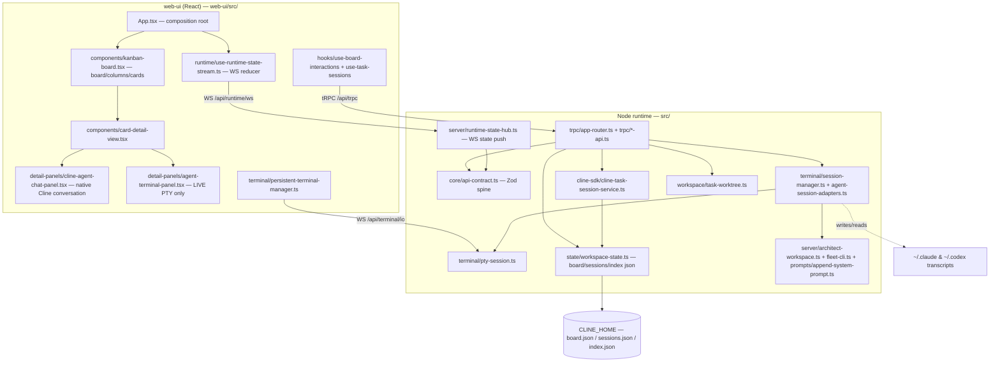

# fleet-kanban — component overview (map for implementation agents)

**Read this before grepping.** It tells you *which component owns what* and *which file to edit for a
given task*, so you don't have to search the whole codebase. Flow: find your task in the
[**"To change X, edit Y" index**](#to-change-x-edit-y-master-index) → skim that component's section →
open only those files. Keep it current: if a change touches files you wouldn't have guessed from
this map, add a row.

> Companion docs:
> - **`docs/architecture.md`** — the *conceptual* map: the mental model, who-owns-what, why Cline is a
>   separate runtime path, design rules and enforced boundaries, and the main flows. Read it for the
>   **why**; read this file for the **where** (which file to edit).
> - `docs/design/architect-steering.md` — the architect arc + roadmap.
> - the parent repo's `AGENT-OPS.md` — on-disk state layout under `CLINE_HOME` (for troubleshooting).

---

## 1. The big picture

Two runtimes — a **Node server** (`src/`) and a **React web-ui** (`web-ui/src/`) — connected by three
transports. Everything typed against one contract (`src/core/api-contract.ts`).

**Transports:** tRPC over `/api/trpc` (mutations/queries), a state **WebSocket** `/api/runtime/ws`
(server → client board/session deltas), and PTY **WebSockets** `/api/terminal/io` + `/control` (live
terminal bytes).

## 2. Two things that will trip you up if you don't know them

- **`src/core/api-contract.ts` is the spine.** Every request/response and every streamed message is a
  Zod schema here; the router validates against it, all `*-api.ts` services type against it, the state
  hub builds messages from it, and **web-ui imports its inferred types**. Changing a schema ripples to
  every consumer *and* to persisted `board.json`/`sessions.json` — treat changes as **additive /
  optional**.
- **There are TWO agent execution paths, and TWO conversation UIs:**
  - **Native Cline agent** → runs through the **Cline SDK** (`src/cline-sdk/`), rendered by
    `detail-panels/cline-agent-chat-panel.tsx`. This path **has persisted-message hydration** — it
    survives session end.
  - **CLI agents** (claude / codex / gemini / opencode / droid / kiro) → run in a **PTY**
    (`src/terminal/`), rendered by `detail-panels/agent-terminal-panel.tsx`. This path is a **live
    terminal only**, gated on `pid != null`; it has **no read-only transcript render**, so a card's
    pane goes **blank once the session ends** (known gap — see architect-steering.md §7).

## 3. Components

### 3a. Backend core + API — `src/core`, `src/trpc`, `src/server`, `src/cli.ts`
Serves the web-ui: typed tRPC API + WS state stream; owns the `kanban` CLI entry; defines the shared
contract. Delegates domain work downward.
- `src/cli.ts` — `kanban` CLI entry (arg parsing, port/TLS, boots server); `src/commands/*.ts` — `kanban task|hooks` subcommands (tRPC clients back to the server).
- `src/core/api-contract.ts` — **the spine** (Zod schemas + inferred types, incl. the stream union); `src/core/api-validation.ts` — `parseX` helpers; `src/core/task-board-mutations.ts` — pure card/column mutation helpers.
- `src/trpc/app-router.ts` — the router (`runtime`/`workspace`/`projects`/`hooks`), `RuntimeTrpcContext`, exports `RuntimeAppRouter` (consumed by web-ui).
- `src/trpc/runtime-api.ts` — Cline sessions/chat, providers, MCP, update; `workspace-api.ts` — git + worktrees + board load/save; `projects-api.ts` — project register/list; `hooks-api.ts` — agent lifecycle hook ingest.
- `src/server/runtime-server.ts` — HTTP(S) server + tRPC wiring + WS upgrade; `runtime-state-hub.ts` — WS hub that pushes contract-typed deltas; `workspace-registry.ts` — workspaceId → scope/terminal-manager/board; `middleware.ts` — CORS/host/TLS.
- `src/config/runtime-config.ts` — persisted Kanban prefs.

### 3b. Cline SDK + persistence + worktrees — `src/cline-sdk`, `src/state`, `src/workspace`, `src/fs`
Bridges to the native Cline SDK and owns all on-disk board/session state + per-card git worktrees.
- `src/state/workspace-state.ts` — **owns read/write of `index.json`, `board.json`, `sessions.json`, `meta.json`** (`loadWorkspaceContext`, `saveWorkspaceState`, `runWorkspaceAtomicMutation`, revision/optimistic-concurrency `WorkspaceStateConflictError`).
- `src/fs/locked-file-system.ts` — atomic `writeJsonFileAtomic` + `withLock` (proper-lockfile) used by all writers; `src/config/cline-home.ts` — `clineHomeDir()` resolves `$CLINE_HOME` (default `~/.cline`).
- `src/workspace/task-worktree.ts` — worktree create/resolve/remove (`ensureTaskWorktreeIfDoesntExist` = `git worktree add --detach`; `deleteTaskWorktree` → `removeTaskWorktreeInternal` = `git worktree remove/prune`); path = `$CLINE_HOME/worktrees/<normalizedTaskId>/<repoLabel>/` (`task-worktree-path.ts`); `turn-checkpoints.ts` — per-turn git checkpoints.
- `src/cline-sdk/sdk-runtime-boundary.ts` — the **sole** `@clinebot/core` import (`createClineSdkSessionHost`, `readMessages`, `resolveClineSdkDataDir`); `cline-session-runtime.ts` — taskId↔sessionId bindings + `readPersistedTaskSession`; `cline-message-repository.ts` — message hydration (`hydrateTaskMessages`, `hydratePersistedMessage`); `cline-task-session-service.ts` — the task facade tRPC calls; `cline-session-state.ts` — summary shape + `createDefaultSummary` (holds `agentSessionId`, checkpoints).
- ⚠ The Cline SDK's **raw messages are NOT in `board.json`/`sessions.json`** — they live in the SDK's own data dir (`resolveClineSdkDataDir`). Two stores.

### 3c. Agent sessions + terminal + agent-config — `src/terminal`, `src/prompts`, `src/server/architect-*`
Spawns per-task CLI agents in PTYs, streams/filters output, locates transcripts for resume, and builds
the architect's system prompt.
- `src/terminal/session-manager.ts` — `TerminalSessionManager`: the orchestrator (classify lifecycle, resolve session id, spawn PTY, wire output/hooks/state, own pid/liveness). **The public class boundary tRPC uses.**
- `src/terminal/agent-session-adapters.ts` — per-agent `prepare()` adapters + the `ADAPTERS: Record<RuntimeAgentId, …>` registry (args/env/hooks/appended-prompt per CLI). **Add a new agent CLI here.**
- `src/terminal/agent-session-launch.ts` — `resolveLaunchSessionId` (mint vs resume) + `classifyAgentSessionLifecycle` (`attached`/`resumable`/`gone`); `agent-transcript-locator.ts` — `locateAgentTranscript` maps (agentId, sessionId) → on-disk `.jsonl` (Claude: glob `~/.claude/projects/*/`; Codex: `~/.codex/sessions/**/rollout-*-<id>.jsonl`).
- `src/terminal/pty-session.ts` — `PtySession` over `node-pty` (spawn/write/resize/pid/kill-group); `agent-registry.ts` — resolve agent binary/args from catalog + PATH; `terminal-protocol-filter.ts` / `terminal-state-mirror.ts` / `session-state-machine.ts` — output filtering/mirror/transitions; `codex-session-capture.ts` — discover Codex's self-assigned id post-spawn.
- `src/server/architect-workspace.ts` — `classifyArchitectWorkspace` (repoPath containment, outermost-container-wins), `resolveHomeAgentContext`, `buildArchitectContextPreamble`; `src/server/fleet-cli.ts` — `runFleetAgentHelp` (shells `fleet help --agent`); `src/prompts/append-system-prompt.ts` — base sidebar prompt + `renderAppendSystemPrompt`.

### 3d. web-ui components (presentation) — `web-ui/src/components`
Renders board/cards/detail/panels/dialogs; pure rendering + event wiring, all data from hooks.
- `web-ui/src/App.tsx` — composition root; `components/kanban-board.tsx` → `board-column.tsx` → `board-card.tsx` — board/columns/tiles.
- `components/card-detail-view.tsx` — full-screen detail; hosts the panels: `detail-panels/cline-agent-chat-panel.tsx` (native Cline conv), `agent-terminal-panel.tsx` (live PTY), `diff-viewer-panel.tsx` (diff + review comments), `file-tree-panel.tsx`, `column-context-panel.tsx`.
- `components/top-bar.tsx`, `project-navigation-panel.tsx` (left sidebar + home-agent panel), `runtime-settings-dialog.tsx` (settings), `task-create-dialog.tsx` / `task-inline-create-card.tsx`, `components/ui/*` (primitives).

### 3e. web-ui client data/state — `web-ui/src/runtime`, `web-ui/src/hooks`, `web-ui/src/terminal`, `web-ui/src/state`
Streams live state, keys the architect chat to a workspace, drives PTYs, issues mutations.
- `runtime/use-runtime-state-stream.ts` — the **WebSocket reducer**; single source of live board/session/chat state (folds `snapshot`, `workspace_state_updated`, `task_sessions_updated`, `task_chat_message`, …); `runtime/trpc-client.ts` — per-workspace tRPC clients; `runtime/agent-chat-workspace.ts` — resolves which workspace hosts the architect chat (`architectWorkspaceId ?? currentProjectId`, `isArchitectChatDetached`).
- `hooks/use-home-agent-session.ts` — architect/home session lifecycle (descriptor keying, start/stop/reload); `hooks/use-home-sidebar-agent-panel.tsx` — composes chat-vs-terminal for the agent; `hooks/use-project-navigation.ts` — project/URL state.
- `hooks/use-task-sessions.ts` — start/stop/input/cleanup/chat facade (calls `runtime.startTaskSession`, `workspace.ensureWorktree`/`deleteWorktree`, `runtime.getTaskChatMessages`, …); `hooks/use-board-interactions.ts` — drag/start/move/trash orchestration; `use-workspace-sync.ts` — persists board via `workspace.saveState`.
- `terminal/use-persistent-terminal-session.ts` — mounts/unmounts xterm (gated on `enabled && workspaceId`); `terminal/terminal-session-liveness.ts` — `hasLiveTerminalSession() = summary.pid != null` (**the gate behind the blank-card bug**); `terminal/persistent-terminal-manager.ts` — the PTY WebSocket transport; `state/board-state.ts` — pure board reducer/normalizers.

## 4. To change X, edit Y (master index)

| I want to change… | Edit |
|---|---|
| A request/response or streamed-message shape | `src/core/api-contract.ts` (**ripples everywhere — additive/optional**) |
| Add a tRPC procedure | `api-contract.ts` (schemas) → `trpc/app-router.ts` → matching `trpc/*-api.ts` impl |
| Add/rename a board or **card field** | `api-contract.ts` (`runtimeBoardCardSchema`) → `core/task-board-mutations.ts` → `state/board-state.ts` (client normalizer) |
| Add a field to the **session record/summary** | `api-contract.ts` (`runtimeTaskSessionSummarySchema`) → `cline-sdk/cline-session-state.ts` (`createDefaultSummary`) |
| A **CLI subcommand** (`kanban …`) | new `src/commands/*.ts` + register in `src/cli.ts` |
| How **projects register / list** | `trpc/projects-api.ts` + `server/workspace-registry.ts` |
| **Board persistence** (json read/write, format, concurrency) | `src/state/workspace-state.ts` (+ `src/fs/locked-file-system.ts` for atomics) |
| **Worktree** path/layout or create/remove/prune | `src/workspace/task-worktree.ts` (+ `task-worktree-path.ts`) |
| How **messages are loaded/hydrated** (native Cline) | `cline-sdk/cline-message-repository.ts` (`hydrateTaskMessages`) |
| Add support for a **new agent CLI** (e.g. gemini) | `terminal/agent-session-adapters.ts` (new adapter + `ADAPTERS`) + `core/agent-catalog` + `agent-registry.ts` + (resume) `agent-transcript-locator.ts` & `agent-session-launch.ts` |
| **Transcript-locator** matching / add a read-only transcript read path | `terminal/agent-transcript-locator.ts` (server) + a new tRPC read proc + client fetch |
| **Resume-vs-fresh** / session lifecycle rules | `terminal/agent-session-launch.ts` |
| **Architect detection** / containment | `server/architect-workspace.ts` (`classifyArchitectWorkspace`) |
| What's **injected into the architect prompt** | `prompts/append-system-prompt.ts` (base) + `server/architect-workspace.ts` (`buildArchitectContextPreamble`) + `server/fleet-cli.ts` (fleet help) |
| **PTY** spawn/kill/liveness (server) | `terminal/pty-session.ts` + `terminal/session-manager.ts` |
| How a **card tile** looks | `web-ui/src/components/board-card.tsx` |
| Board **columns / drag-drop / dependencies** | `components/kanban-board.tsx`, `board-column.tsx` |
| Add a **tab/panel to the card detail view** | `components/card-detail-view.tsx` + new file in `components/detail-panels/` |
| The **native Cline conversation** display | `components/detail-panels/cline-agent-chat-panel.tsx` |
| The **terminal / CLI-agent** display | `components/detail-panels/agent-terminal-panel.tsx` |
| **Diff / review-comment** UI | `components/detail-panels/diff-viewer-panel.tsx` |
| A **settings** option | `components/runtime-settings-dialog.tsx` |
| **Project navigation / sidebar** | `components/project-navigation-panel.tsx` |
| **Task-create** form fields | `components/task-create-dialog.tsx`, `task-inline-create-card.tsx` |
| **When the live terminal mounts/tears down** / the `pid != null` gate | `web-ui/src/terminal/use-persistent-terminal-session.ts` + `terminal-session-liveness.ts` |
| Which **stream messages** are handled/exposed (client) | `web-ui/src/runtime/use-runtime-state-stream.ts` |
| How the **architect chat persists across project switches** | `web-ui/src/runtime/agent-chat-workspace.ts` + `App.tsx` (pinned/enabled second stream) |
| Add a **board action** (create/start/move/cleanup) | `web-ui/src/hooks/use-board-interactions.ts` + `use-task-sessions.ts` |

## 5. Gotchas / stale docs

- **`web-ui/src/kanban/` does not exist in this fork.** The only tree is `web-ui/src/components/`; the
  only path alias is `@` → `src` (no `@/kanban`). References to `@/kanban/...` in `AGENTS.md`/`CLAUDE.md`
  are **stale upstream docs** — always edit `web-ui/src/components/...`.
- **`App.tsx` vs `app.tsx`** — macOS's case-insensitive filesystem makes these resolve to one file;
  don't create a "second" one. Use `App.tsx`.
- **Two agent paths / two conversation UIs** (see §2) — always check whether you're touching the Cline
  SDK path or the PTY path before editing "the conversation view."
- **`api-contract.ts` changes are wire + on-disk compatibility changes** — additive/optional only.
- **Two persistence stores** — Kanban's `workspace-state.ts` json vs the Cline SDK's own message store;
  they are not the same files.
